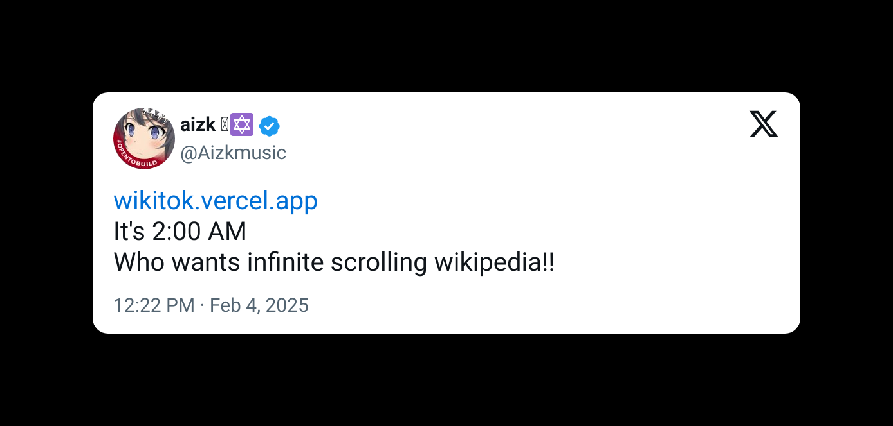

    <h1>Wikitok</h1>

Tiktok, but it's Wikipedia. Wikitok combines the addictive TikTok scroll with the knowledge of Wikipedia, allowing you to discover new articles in a fun, fast-paced format.

    <h2>Screenshots</h2>
    

        <video src="./readme/demo.mov">
    

    <h2>Inspiration</h2>
    

        <a href="https://x.com/tylerangert/status/1886560290864533983" alt="inspiration post">This tweet</a> from <a href="https://x.com/tylerangert" alt="@tylerangert on x.com">@tylerangert</a>.
    

    

        
    

    

        Also, <a href="https://x.com/Aizkmusic/status/1886669151516705028" alt="inspiration post 2">this tweet</a> from <a href="https://x.com/Aizkmusic" alt="@Aizkmusic on x.com">@aizkmusic</a>.
    

    

        
    

---

    Made with ♥️ by 
    <a href="https://github.com/ArnavGuptaaa">Nav</a>.

